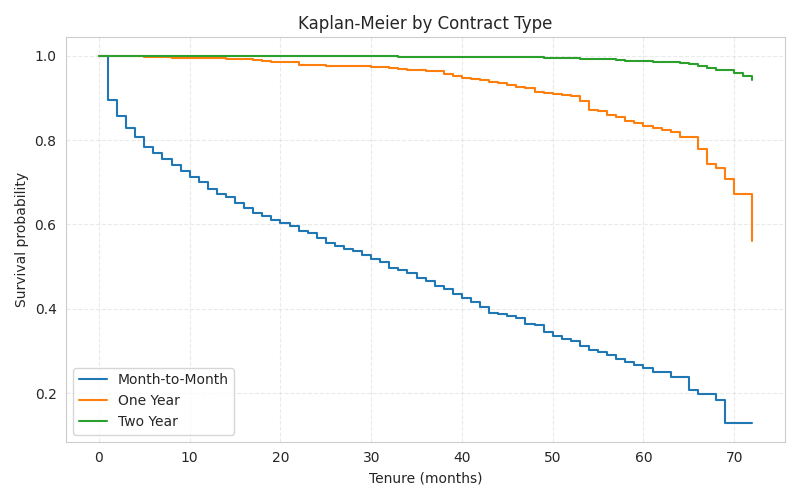

# 📊 Telco Customer Churn Analysis: From Python to Power BI

Hi there! This is a portfolio project where I dive deep into a Telecom dataset to figure out why customers are leaving and how to stop them.

## 📂 Files in this Repo
* `Churn Project.pbix`: The interactive Power BI Dashboard containing the final strategic analysis.
* `Churn Data.csv`: The raw dataset used for this analysis.
* `notebooks/`: Contains the Python code used for the Survival Analysis (Kaplan-Meier).
* `images/`: Static exports of the visualizations.

## 🛠️ The Tech Stack
* **Python (Pandas & Lifelines):** Used for preprocessing and running a Kaplan-Meier Survival Analysis to determine *when* customers are most likely to churn.
* **Power BI:** Used for DAX measures, data modeling, and building the interactive executive dashboard.

## 💡 Key Insights
1.  **The "Offer E" Trap:** A specific marketing offer was causing a 60% churn rate.
2.  **Hardware Matters:** High-value customers weren't leaving for lower prices; they were leaving for better devices.
3.  **Support Shield:** Premium Tech Support reduces churn risk by ~50%.

## 📈 Visual Preview

*My Python analysis showing the probability of survival over time by contract type.*
